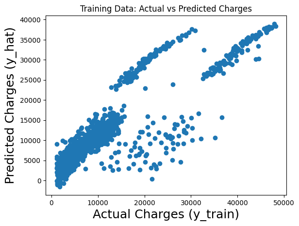
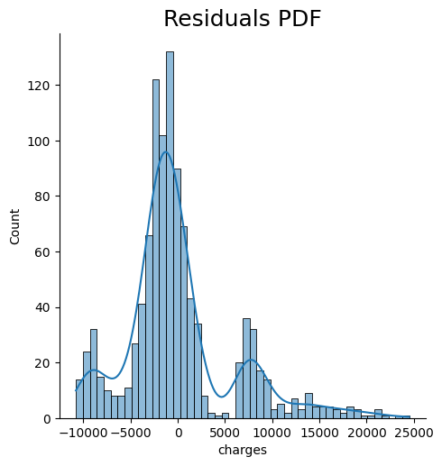
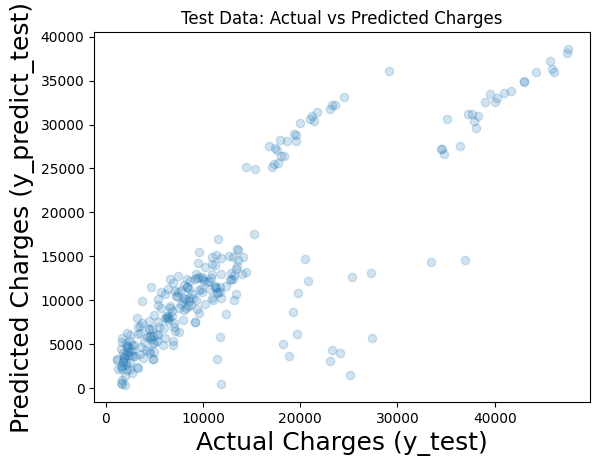

# Sigorta Ücretleri Tahmini

Bu proje, yaş, cinsiyet, BMI, çocuk sayısı ve sigara içme durumu gibi çeşitli faktörlere dayalı olarak sigorta ücretlerini tahmin etmek için bir doğrusal regresyon modeli geliştirmeyi amaçlamaktadır.


## İçindekiler

- [Proje Tanımı](#proje-tanımı)
- [Kullanılan Teknolojiler](#kullanılan-teknolojiler)
- [Kurulum](#kurulum)
- [Veri Açıklaması](#veri-açıklaması)
- [Sonuçlar](#sonuclar)

## Proje Tanımı
Bu projenin amacı, sigortalı bireylerle ilgili çeşitli özellikleri kullanarak sigorta ücretlerini tahmin etmektir. Verilen veri kümesi kullanılarak bir doğrusal regresyon modeli oluşturulmuştur.

## Kullanılan Teknolojiler
- Python
- Pandas
- NumPy
- Scikit-learn
- Seaborn
- Matplotlib

## Kurulum

Kurulum için gerekli kütüphanelerin kurulması için ```pip install -r requirements.txt ```


## Veri Açıklaması
Bu projede kullanılan veri seti `insurance.csv` dosyasını içermektedir. Bu dosya aşağıdaki sütunları içermektedir:
- `age`: Sigortalı bireyin yaşı
- `sex`: Sigortalı bireyin cinsiyeti (erkek/kadın)
- `bmi`: Vücut Kütle İndeksi
- `children`: Sigorta kapsamında olan çocuk/dependents sayısı
- `smoker`: Sigara içme durumu (evet/hayır)
- `region`: İkamet edilen bölge (son modelde kullanılmamıştır)
- `charges`: Sağlık sigortası tarafından faturalandırılan tıbbi maliyetler

## Sonuçlar

|   Features          |    Coefficients    |
|---------------------|---------------------|
| age                 | 3433.262403         |
| sex                 | -53.648936          |
| bmi                 | 1851.343930         |
| children            | 561.041833          |
| smoker_yes          | 9120.013394         |
| region_northwest    | -221.591161         |
| region_southeast     | -467.136083        |
| region_southwest     | -522.861935        |


__Intercept__: **12711.65** <br>
__Training Score__: **0.74** <br>
__Test Score__: **0.71** <br>


### Actual vs Prediction


### Residual PDF



### Test Data vs Prediction Data



## Yorum 
Genel olarak, model sigorta ücretlerini tahmin etme konusunda olumlu sonuçlar elde etmiştir. Özellikle yaş, BMI ve sigara içme durumu gibi değişkenlerin önemli etkileri olduğu görülmektedir. Ancak, modelin daha da geliştirilmesi ve daha fazla değişkenin göz önüne alınması, tahmin doğruluğunu artırabilir.