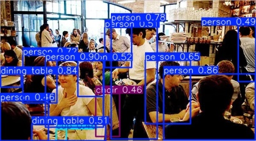

# Ödev 2

## Proje Amacı:

### Bu proje, yolo11x kullanarak gerçekleştirilmiştir. Farklı resimler kullanarak yolo kütüphanesi ile tespiti için yapılmıştır.

## Kullanılan Model:

- Model: **YOLO11x**
- Hedef: Nesneleri tanımlamak ve tespit edilen her nesne için tahmin doğruluğunu göstermek.

## Sonuçlar:

### 1. Trafik Yolu Üzerindeki Araçlar

Yukarıdaki görüntüde **YOLO modeli**, çeşitli araçları (kamyon ve arabalar) doğru bir şekilde tanımladı. Tespit edilen her aracın üzerine, **tanım** ve **doğruluk oranı** (confidence score) eklenmiştir. Araçlar, genellikle yüksek doğruluk oranlarıyla tespit edilmiştir.

### 2. İnsan Tespiti

Bu görüntüde model, bir kişiyi yüksek doğrulukla (**0.95**) tespit etti. Arka planda yer alan yapılar ve diğer unsurlar göz ardı edilerek, **kişi** nesnesi başarılı şekilde ayrıştırılmıştır.

### 3. Denizdeki Yelkenciler

Bu görüntüde model, yelkenli tekneleri minimum (**0.55**) olarak belirlerken instanları minimum (**0.68**) olarak belirleyebilmiştir.

### 4. Balık Mezatı

Bu görüntüde model, insan ve sandalye gibi cisimleri algılarken balıkları tespit edememiştir.

### 5. Trafalgar Meydanı

Bu görüntüde model, insan, sırt çantası ve otobüsü algılayabilmiştir ama arka plandaki yer alan yapıları tespit edememiştir.

### 6. Restaruant

Bu görüntüde model, insan, yemek masası ve sandalye gibi cisimleri başarılı şekilde tespit edebilmiştir ama arka plandaki bardakları algılayamamıştır.

### 7. Yemek Masası

Bu görüntüde model, masa, sandalye, bardak ve hatta şarap bardağı olduğuna kadar doğru şekilde tahmin etmiştir.

### 8. Cafe

Bu görüntüde model, kalabalık ortamdaki insanları, sandalyeleri ve saksı bitkisine kadar her şeyi doğru tahmin etmiştir.

### 9. Salon

Bu görüntüde model, bir salondaki neredeyse her şeyi tahmin edebilmiştir. Lakin, arka plandaki tabloyu tespit edememiştir.

### 10. Kedi ve Köpekler

Bu görüntüde model, kedi ve köpekleri yüzdesi yüksek bir şekilde tahmin etmiştir.

### Video tespiti

Bu video model, insan ve araçları başarılı şekilde algılamıştır. Sadece bir yerde saat tespiti yanlıştır.