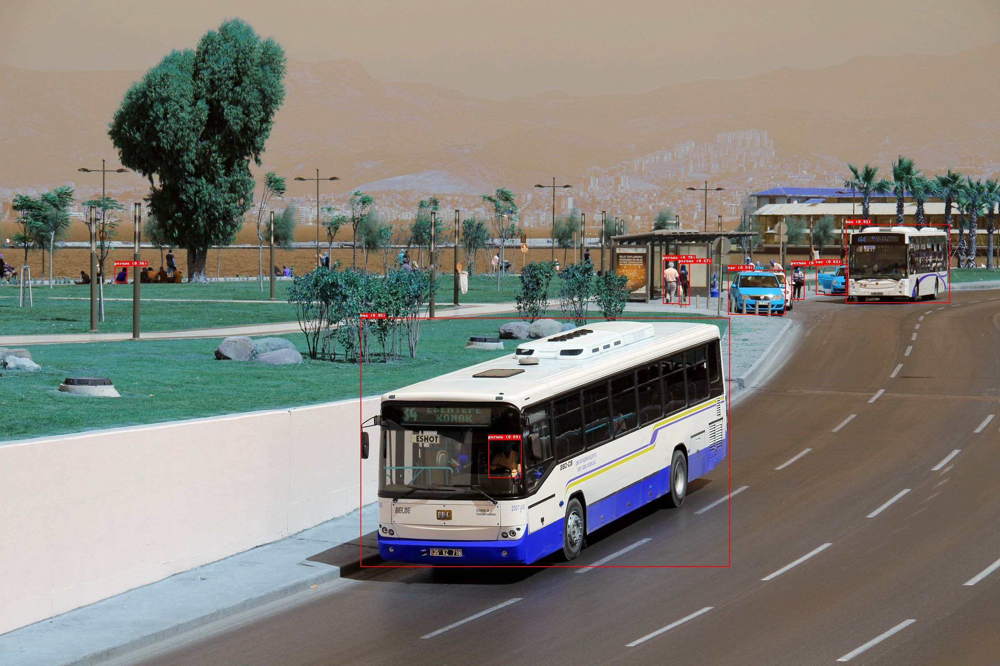

# YOLOv11x.pt Modeli ile Nesne Algılama Raporu

## Giriş

Bu rapor, YOLOv11x.pt modeli kullanılarak gerçekleştirilen nesne algılama deneyinin sonuçlarını sunmaktadır. ## 

## Sonuçlar
### Rest API verilen fotoğraf 1

Yukarıdaki fotoğraftan görüleceği gibi en uzaktaki insanı bile algılayabilmiştir. Fotoğraftaki tahmin yüzdeleri yüksektir. Hatta öndeki otobüsün şöfürü gölgede kalmasına rağmen onu bile algılayabilmiştir.

### Rest API verilen fotoğraf 2

Yukarıdaki fotoğrafta bir tekne ve denizcinin olduğunu %95 tekne ve %80 insan olduğunu algılayabilmiştir.

### Rest API verilen fotoğraf 3

Yukarıdaki fotoğraf kalabalık bir ortamda insanları çok iyi şekilde algılayabilmemiş. Sadece sahnedeki gruptaki insanları algılayabilmiştir.
